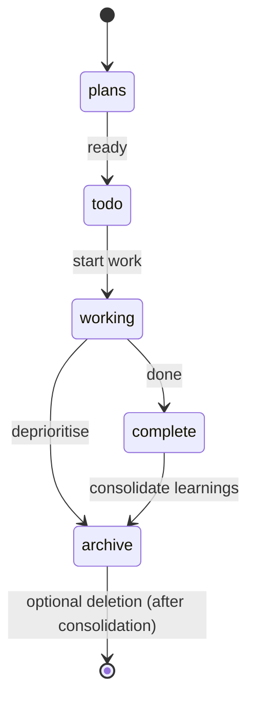

## Executive summary

A Git‑native, Markdown‑first task workflow treats the repository as the canonical workspace: each task is a self‑contained Markdown file, folder position encodes lifecycle state, and Git provides the audit trail. This pattern prioritises **context preservation**, **portability**, and **agent compatibility** while avoiding external dependencies. The core primitives are simple; the value comes from disciplined task authoring, short verifiable checkpoints, and a small set of repository‑local conventions that prevent drift.

## TL;DR

- Keep tasks as Markdown files; folder location is the canonical state.  
- Use short, verifiable checkpoints and a timestamped progress log so agents and humans can resume work.  
- Add explicit **In scope / Out of scope** blocks and a **Related components** list to every plan to prevent drift.

## Introduction

This write-up describes an experimental Git‑native task management pattern that treats a repository as the canonical workspace for work state. The intention is to contribute to broader discussions about minimal, portable coordination patterns that work for both humans and agents.

## Problem

Conventional project management tools and scattered notes often fail to preserve the context necessary for consistent, long‑running work. In practice, the recurring issues are:

- Context loss across sessions and contributors.  
- Duplicate or divergent implementations because discovery is poor.  
- Difficulty integrating automated contributors without custom connectors.

These problems are not unique to AI workflows; they appear whenever the working context is fragmented between tools, ephemeral notes, and undocumented decisions. To make the problem tractable, a deliberate constraint was imposed: the solution must require no external services and must work with a text editor and Git alone. That constraint clarifies trade‑offs and keeps the system portable, auditable, and suitable for any environment.

## Approach

The approach is intended to be simple and pragmatic. Tasks are plain Markdown files. Folder location encodes lifecycle state. Git is the audit trail. The repository is the substrate for coordination; tooling and automation are optional layers that sit on top of the core workflow.

A task file is intended to be a self‑contained working context: scope, goals, an atomic breakdown of work, and a progress log. Agents and humans read the same file; both append progress and commit changes. Moving a file between folders represents a state transition and is recorded in Git history.

### Canonical structure

```text
tasks/
  plans/
  todo/
  working/
  complete/
  archive/
```

The root `tasks/` folder is the workspace. Subfolder location encodes status, making state visible without requiring a separate database.

## Task format and conventions

Recommended conventions reduce ambiguity and make files machine‑friendly without sacrificing readability.

### Filename

- Prefer: `YYYY-MM-DD-short-title.md` for chronological ordering and traceability.

### Front matter and metadata

- **Created:** `YYYY-MM-DD`  
- **Status:** `Planned | In Progress | Completed | Abandoned`  
- **Owner / Agent:** identity responsible for the work  
- **Started / Completed** dates where applicable

### Example sections for scope discipline

Every task must include the following blocks near the top of the file. These are the canonical gate for scope decisions.

**In scope**  

- Short, specific list of deliverables and behaviours the task will change. One line per item.

**Out of scope**  

- Short, specific list of things explicitly excluded from this task. One line per item.

**Related components**  

- List the code modules, services, and docs that the task will touch or should be reviewed after changes. One line per item.

**Acceptance criteria**  

- One or two measurable checks that must pass before the task is moved to `complete/`.

These blocks prevent drift: anything not listed in **In scope** should be treated as out of scope and either deferred or created as a child task. Reviewers and agents should use them as the first filter when evaluating changes.

### Example sections

- **Overview** — a one-sentence description of the task and the expected outcome
- **Goals** — measurable outcomes or acceptance criteria  
- **Approach** — high‑level strategy and constraints  
- **Atomic Breakdown** — numbered sub‑tasks with estimated effort and target files  
- **Progress Log** — timestamped journal of actions, decisions, and blockers  
- **Learnings** — insights to migrate to the knowledgebase on completion  
- **Files Changed** — list of modified files and intent for traceability

## Lifecycle and state transitions

Folder position is the canonical state. The typical lifecycle is:

`plans/` → `todo/` → `working/` → `complete/` (or `archive/`)

Transitions are performed by humans, agents, or automation (CI scripts). The act of moving a file and committing the change is the state transition; the commit message and the progress log together form the audit trail. For practical discipline:

- Use `git mv` or an explicit move commit to avoid editor/Git integration quirks.  
- Treat `archive/` as a gated exit: files should only be deleted from `archive/` after learnings are consolidated.

## Execution model

Tasks are documentary by default: they describe what to do, not how to run it. A typical session — human or agent — follows a consistent pattern:

1. Session start: read `working/` files and prioritise.  
2. Context load: use the task file as the working context.  
3. Execution: work through the Atomic Breakdown and produce artefacts.  
4. Progress update: append timestamped entries and update goals.  
5. Commit: create durable checkpoints in Git.  
6. Completion: move the file to `complete/` and migrate learnings.

Human involvement is concentrated at the planning stage. A well‑scoped task file is the primary lever on output quality. Agents should be instructed to stop at decision boundaries that require human judgement; in practice, well‑configured agents reliably pause when they encounter architectural or irreversible choices.

## Emergent patterns and operational lessons

Several useful conventions emerged from practice rather than design:

- **File‑level isolation:** each task is an atomic unit, which reduces collision surface for parallel contributors.  
- **Progress Log as crash recovery:** timestamped entries let a new session resume work reliably.  
- **Learnings migration:** capture non‑obvious insights in a `Learnings` section and promote them to a knowledgebase to build institutional memory.

The knowledgebase as a research artefact is a further emergent property worth noting. In practice, the knowledgebase can grow from task Learnings migrations into a curated set of files that record observed failure modes, model compatibility notes, and operational patterns. These are distilled principles and observations that prevent recurrence of specific issues. Preserving these negative results as forward context is one of the system’s most practical benefits.

### Common failure modes and mitigations

- **Context exhaustion on long tasks.** If a progress log grows too large, the task file itself becomes a context problem. The correct response is to split the remaining work into child tasks, summarise the completed log, and migrate detail to the knowledgebase.  
- **Editor/Git integration quirks.** Some editors produce phantom untracked files when moving files between folders; using `git mv` and committing moves explicitly mitigates this.  
- **Documentation lag.** Agent instructions and skills require ongoing maintenance; a periodic lightweight maintenance pass helps keep documentation aligned with code and conventions.

## Layered agent instruction architecture

A practical pattern that emerged is a three‑layer instruction architecture that sits above the task system and provides an agent‑facing API.

1. **Standing orchestration rules.** A top‑level briefing file carries global constraints that apply at every session: the Session Start Protocol, security handling rules, architectural invariants, and links to the knowledgebase. This file is the agent’s standing briefing.  
2. **File‑triggered instruction sets.** Instruction files scoped by glob patterns load domain‑specific lessons automatically when an agent opens a matching file type. These files encode dated post‑mortems and corrective patterns so agents receive forward‑prevention guidance rather than a static style guide.  
3. **On‑demand skills.** A skills catalogue contains explicitly invokable modules (task planning, knowledge consolidation, review patterns, and cognitive checks). Skills are authored as small, composable workflows with clear triggers, ordered steps, and expected outputs. New skills are created from observed patterns and migrated learnings, so the catalogue grows organically with usage.

This layered model turns operational experience into executable context: the task file provides the immediate working frame, instructions provide domain constraints, and skills provide the procedural API agents invoke.

## Artefacts, traceability, and examples

Tasks commonly produce:

- Source code changes committed to the repository.  
- Knowledgebase entries promoted from `Learnings` sections.  
- Memory or session artefacts stored under repository paths.  
- Generated schemas or other artefacts committed alongside code.  
- Spawned child tasks in `plans/` or `todo/`.

Traceability is informal but effective: a `Files Changed` section in the task file, commit messages that reference task filenames, and cross‑references in the knowledgebase provide sufficient linkage/discoverability for most workflows.

### Anonymised case study

**Project:** Multi‑phase feature rollout (anonymised)  
**Context:** A feature required backend changes, a tool integration, and a small web UI. The team used the Git‑native workflow to coordinate human and agent work across three phases.

**Phase summary**  

- **Phase 1** — API contract and backend scaffolding (plan → todo → working).  
- **Phase 2** — Tool integration and DI wiring (atomic tasks, integration tests).  
- **Phase 3** — Web UI and E2E verification (hooks, pages, build verification).

**Representative progress log excerpt (anonymised)**  

- 2026‑03‑21 09:12 — Task created: define API contract and verification steps  
- 2026‑03‑21 11:05 — Backend scaffold implemented; checkpoint commit A  
- 2026‑03‑21 13:40 — Tool integration implemented; DI wired; integration tests added; commit B  
- 2026‑03‑22 10:20 — UI hooks added; local build passed; E2E smoke test passed; task moved to complete

**Outcome and lesson**  
The task file served as the single working context for both human and agent sessions; the agent resumed reliably after an interrupted session using the progress log. Short, verifiable checkpoints and a clear atomic breakdown prevented duplicated implementations across parallel workstreams.

## Policies and conventions to formalise

A number of useful conventions remain informal and would benefit from lightweight automation or repository‑local checks:

- **Staleness enforcement** (for example, flag `working/` files with no progress in seven days).  
- **Scope‑creep gates** that require explicit human sign‑off for major deviations.  
- **Commit discipline** to avoid bundling unrelated code with state transitions.  
- **Naming enforcement** for consistent traceability.  
- **Minimum progress log quality** to preserve RAG value.

Some of these checks can be implemented as read‑only tools in a repository (for example, tools that scan lifecycle folders and report missing sections, stale tasks, or naming issues). Encoding conventions as callable tools rather than only as documentation is another way to enforce them under autonomous operation or provide more deterministic behaviour.

## Scaling considerations and open problems

File‑based task management seems to work well for a solo developer managing multiple agents. In practice, this approach has managed a large number of task files across multiple delivery phases and remediation programmes without introducing significant operational overhead. The main cost is discipline, particularly at the planning stage.

The primary open problem is concurrency at scale. To scale to dozens of agents and contributors, the next experiments should focus on leveraging multiple branches for parallel workstreams, implementing locking or reservation patterns for `working/` files, and exploring merge strategies.

## Why this approach

A Markdown file in a Git repository is the lowest‑friction artefact an automated process or human can work with: readable, writable, versionable, and semantically indexable. Git provides the properties that matter like history, branching, blame, and revert, and Markdown provides broad compatibility across tools and models. This combination makes the repository a practical substrate for coordinating work across multiple agents and agent platforms without introducing external dependencies.

This pattern is intended as a low‑friction baseline for comparing lightweight repository‑first task workflows against more structured systems.

## Example templates and visuals

**Ready task template (anonymised)**

```markdown
Created: YYYY‑MM‑DD  
Status: Planned  
Owner: <your name or team>

In scope
- Short, specific deliverable or change A  
- Short, specific deliverable or change B

Out of scope
- Explicitly excluded item X  
- Explicitly excluded item Y

Related components
- src/example/moduleA.cs  
- clients/web-ui/src/hooks/useExample.ts  
- .github/knowledgebase/

Overview
One‑sentence description of the task, the context, and the expected outcome.

Goals
- Measurable outcome 1  
- Measurable outcome 2

Approach
High‑level strategy and constraints.

Atomic Breakdown
1. Small step A — expected files changed  
2. Small step B — expected tests

Progress Log
YYYY‑MM‑DD HH:MM — Task created and scoped

Learnings
- Short bullet list of non‑obvious insights

Files Changed
- path/to/expected/file
```

Suggested commit message for a state transition
`docs(task): move YYYY‑MM‑DD-short-title.md → working — start work on <short description>`

Suggested PR description checklist
- [ ] Task file moved to correct folder and front matter updated  
- [ ] Progress log contains at least one checkpoint commit message  
- [ ] Files Changed section lists the primary modified files



## Visuals

**Lifecycle diagram (Mermaid source)**



**Agent session sequence (text)**

1. Agent reads all files in `working/` and extracts title, status, last progress entry.  
2. Agent loads the task file as working context and executes the next atomic step.  
3. Agent appends a timestamped Progress Log entry and commits changes.  
4. On completion, agent moves the file to `complete/` and migrates Learnings to the knowledgebase.

## Conclusion

Treating a repository as the canonical workspace for tasks is a pragmatic, low‑friction approach to preserving context and coordinating agentic contributors. It is not a replacement for full‑featured project management systems; it is a different primitive for portability, auditability, and direct compatibility with the tools engineers already use. The approach works best when combined with disciplined task authoring, small atomic work units, and a habit of migrating learnings into a knowledgebase.

It is a repository‑local pattern for organizing task files and learnings. The full specification and examples can be kept alongside (or integrate with) other repository documentation.
